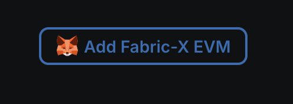
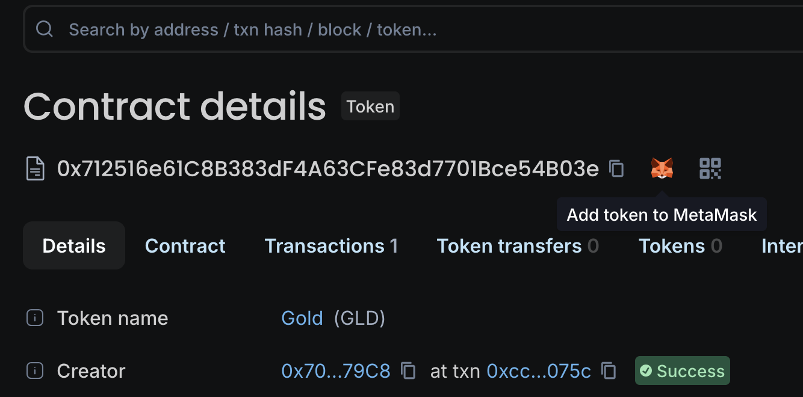

# fabric-x-evm

Run Solidity smart contracts on Fabric-X. Fabric-x-evm exposes a
standard Ethereum JSON-RPC endpoint, so your existing contracts, tools
(Hardhat, Foundry, MetaMask), and workflows work without modification — while
the chain underneath gives you Fabric-X's high throughput and low latency, permissioned access
control, and enterprise-grade consensus.

## Prerequisites

- [Docker](https://docs.docker.com/get-docker/) with Compose v2
- [Foundry](https://book.getfoundry.sh/getting-started/installation) (`cast`) — for the demo deploy/transfer commands
- [MetaMask](https://metamask.io/) browser extension _(optional, for the wallet walkthrough)_

## Quick start

Stand up a full Fabric-X EVM network with a block explorer in two commands:

```shell
make init     # generate crypto material (one-time)
make start    # start the network + Blockscout explorer
```

To run without the block explorer use `make start-node` instead.

Verify the RPC is live:

```shell
curl -s http://localhost:8545 \
  -X POST -H 'Content-Type: application/json' \
  -d '{"jsonrpc":"2.0","method":"eth_blockNumber","params":[],"id":1}'
# → {"jsonrpc":"2.0","id":1,"result":"0x..."}   (result is the current block height, in hex)
```

The block explorer is at **http://localhost:8000** (may take a minute to fully load).

### Deploy a token

Deploy an ERC-20 token by choosing a name and symbol. The contract
([src/Token.sol](src/Token.sol)) is a standard
[OpenZeppelin ERC-20](https://docs.openzeppelin.com/contracts/5.x/erc20) with
name, symbol, and initial supply passed to the constructor. The deploy uses the
prebuilt `erc20.bin`; edit the source and run `make build` to recompile it.
The built-in test accounts have no gas cost, so no prefunding is needed.

```shell
make deploy NAME="Digital Euro" SYMBOL=EURX
```

The explorer URL is printed immediately:

```
Deployed Digital Euro (EURX): http://localhost:8000/address/0x...
```

### Transfer tokens

```shell
make transfer TO=0xf39Fd6e51aad88F6F4ce6aB8827279cffFb92266 AMOUNT=500
```

```
Transferred 500 tokens to 0x...: http://localhost:8000/tx/0x...
```

### Verify the contract

Publish the source so the explorer can match it against the deployed bytecode.
Verification is done locally by the bundled verifier service — no external
lookups:

```shell
# pass the same NAME/SYMBOL/SUPPLY you deployed with:
make verify NAME="Digital Euro" SYMBOL=EURX
```

Once verified, the explorer shows the Solidity source and unlocks the
**Read Contract** / **Write Contract** tabs — call `balanceOf`, `transfer`, and
the rest straight from the browser, with no extra tooling. Prefer clicking?
Open the contract's **Contract → Verify & publish** tab and paste
[src/Token.sol](src/Token.sol) instead.

**You're now running your own Fabric-X EVM network.** Deploy your own contracts
with any tooling you're familiar with.

### Add to MetaMask _(optional)_

To use MetaMask with the test wallet, import this private key
([instructions](https://support.metamask.io/start/use-an-existing-wallet/#import-using-a-private-key)):
open the extension → your account → Add Wallet → Private Key, and enter
`0xac0974bec39a17e36ba4a6b4d238ff944bacb478cbed5efcae784d7bf4f2ff80`.

> [!WARNING]
> This is the well-known Hardhat account #0. **Never use it on a public
> network** — it will be drained instantly.

> [!IMPORTANT]
> If you've used MetaMask with this network before and restarted with a clean
> state, reset the account: Settings → Developer tools → Delete activity and nonce data.

Open the token URL from the deploy step. Scroll to the bottom and click
**"Add Fabric-X EVM"** to add the network to MetaMask (only needed once):



Then click the MetaMask logo next to the token contract address to add the
token to your wallet:



Switch to MetaMask and confirm the tokens arrived. Try sending some back —
there's no gas cost, so experimenting is free.

### Stop and reset

```shell
make stop    # stop all containers (data is preserved)
make purge   # stop and delete all data
```

After a purge, reset MetaMask: Settings → Developer tools → Delete activity and nonce data.

## Next steps

Point any Ethereum tooling at `http://localhost:8545` with chain ID `4011` (or
your custom `CHAIN_ID`).

**Hardhat** — add a network entry to `hardhat.config.js`:

```javascript
networks: {
  fabricx: {
    url: "http://localhost:8545",
    chainId: 4011,
    accounts: ["0x59c6995e998f97a5a0044966f0945389dc9e86dae88c7a8412f4603b6b78690d"]
  }
}
```

**Foundry** — add to `foundry.toml` and deploy:

```toml
[rpc_endpoints]
fabricx = "http://localhost:8545"
```

```shell
forge create --rpc-url fabricx \
  --private-key 0x59c6995e998f97a5a0044966f0945389dc9e86dae88c7a8412f4603b6b78690d \
  src/MyContract.sol:MyContract
```

To learn more about Fabric-X, visit the
[fabric-x](https://github.com/hyperledger/fabric-x) and
[fabric-x-evm](https://github.com/hyperledger/fabric-x-evm) repositories.

## Alternative runtimes

Pass `DOCKER=podman COMPOSE="podman compose"` to any `make` target:

```shell
make start DOCKER=podman COMPOSE="podman compose"
```
